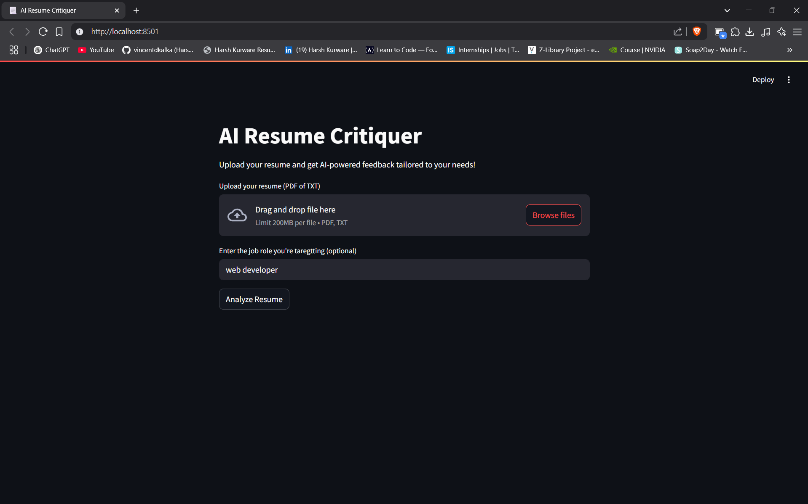

# 📄 AI Resume Guide

This is an AI-powered resume analysis tool built with **Streamlit** and **OpenAI's GPT-3.5**. Upload your resume, specify a job role, and get personalized, constructive feedback to improve your resume for better job opportunities.

## 🚀 Features

- Upload resumes in PDF or TXT format.
- Receive AI-generated feedback on:
  - Content clarity and impact
  - Skills presentation
  - Experience descriptions
  - Tailored suggestions based on job role
- Simple, intuitive web interface using Streamlit.
- Powered by OpenAI’s GPT-3.5 model.

## 🛠️ Technologies Used

- [Streamlit](https://streamlit.io/)
- [OpenAI API](https://platform.openai.com/)
- [PyPDF2](https://pypi.org/project/PyPDF2/)
- [python-dotenv](https://pypi.org/project/python-dotenv/)

## 📦 Installation & Setup

1. **Clone the repository:**
   ```bash
   git clone https://github.com/yourusername/ai-resume-guide.git
   cd ai-resume-guide
   ```
2. **Create a virtual environment (optional but recommended):**

   ```
   python -m venv venv
   ```
   Activate the Virtual Environment:

   - Windows
   ```venv\Scripts\activate```
  
   - MacOS/Linux
   ```source venv/bin/activate```

3. **Install Dependencies**

   ```
   pip install -r requirements.txt
   ```
4. **Create a .env file in the root directory with your OpenAI API key:**
   ```
   OPENAI_API_KEY=your_openai_api_key_here
   ```

6. **Run the app:**
   ```
   uv run streamlit run python main.py (I have used UV for Package management, if you are using Pip use normal command)
   ```

## 📸 Screenshot

Here is a screenshot of the AI Resume Analyst using Streamlit


## 🔐 Disclaimer
   This tool uses the OpenAI API. Keep your API key secure and avoid uploading sensitive or confidential personal information.

## 📬 Contact
   For feedback or inquiries, feel free to reach out at harshkurware03@gmail.com.
